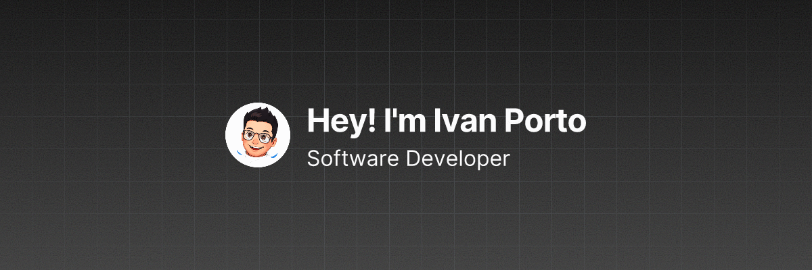

  

  

    
      <b>LinkedIn</b>
      &nbsp;·&nbsp;
    
    
      <b>Portfolio</b>
      &nbsp;·&nbsp;
    
    
      <b>Email</b>
      &nbsp;·&nbsp;
    
    
      <b>X (Twitter)</b>
      &nbsp;·&nbsp;
    
    
      <b>Resume</b>
      &nbsp;·&nbsp;
    
    
      <b>Bento</b>
    
  

# 👋🏻 Hi There!

My name is Ivan, I'm a software developer based in Barcelona. I have a **Bachelor in Game Design and Development**, although these days I am not planning on pursuing games as a professional career. Instead, I am focused on becoming specialized in backend development and cloud engineering.

## 🌟 Skills

Some of the technologies I worked with are:

<table>

  <thead>
    <tr>
      <th>Category</th>
      <th>Technologies</th>
    </tr>
  </thead>

  <tbody>
    <tr>
      <td>Languages</td>
      <td>
        

          
          
          
        

      </td>
    </tr>
    <tr>
      <td>Creative</td>
      <td>
        

          
          
        

      </td>
    </tr>
    <tr>
      <td>Frontend</td>
      <td>
      

        
        
        
        
        
        
      

      </td>
    </tr>
    <tr>
      <td>Backend</td>
      <td></td>
    </tr>
    <tr>
      <td>Cloud&nbsp;/&nbsp;Infra</td>
      <td>
        

          
          
          
        

      </td>
    </tr>
    <tr>
      <td>Tooling</td>
      <td>
      

        
        
        
        
      

      </td>
    </tr>
  </tbody>
</table>

## 🏆 Stats

## 📌 Pinned
